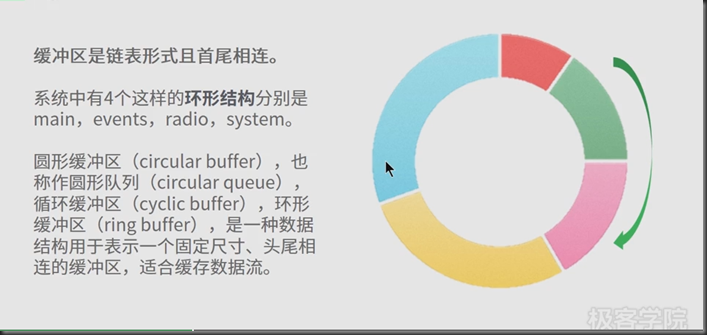

### 一、logcat命令介绍

#### 1.android log系统：


#### 2.logcat介绍：


```
logcat是android中的一个命令行工具，可以用于得到程序的log信息
```

log类是一个日志类，可以在代码中使用logcat打印出消息

* 常见的日志纪录方法包括：

| 方法                          | 描述         |
| ----------------------------- | :----------- |
| v(String,String) (vervbose)   | 显示全部信息 |
| d(String,String)(debug)       | 显示调试信息 |
| i(String,String)(information) | 显示一般信息 |
| w(String,String)(waning)      | 显示警告信息 |
| e(String,String)(error)       | 显示错误信息 |

例如：

```
//开发过程中获取log
Log.i("MyActivity","MyClass.getView() - get item number"+position);
//adb获取log
adb logcat
```

adb logcat输出的日志格式如下：

```
I/ActivityManager( 1754): Waited long enough for: ServiceRecord{2b24178c u0 com.google.android.gms/.checkin.CheckinService}
```

#### 3.logcat命令格式：


语法格式：

```
[adb] logcat [<option>] … [<filter – spec>] …
```

PC端使用：

```
adb logcat
```

shell模式下使用：

```
logcat
```

### 二、logcat缓冲区


#### 1.缓冲区介绍：


android log输出量巨大，特别是通信系统的log，因此，android把log输出到不同的缓冲区中，目前定义了四个log缓冲区：

1）Radio：输出通信系统的log

2）System：输出系统组件的log

3）Event：输出event模块的log

4）Main：所有java层的log，遗迹不属于上面3层的log

缓冲区主要给系统组件使用，一般的应用不需要关心，应用的log都输出到main缓冲区中

默认log输出（不指定缓冲区的情况下）是输出System和Main缓冲区的log

 

#### 2.缓冲区模型：





#### 3.获取缓冲区命令：


| 参数       | 描述                                             |
| ---------- | :----------------------------------------------- |
| -b<buffer> | 加载一个可使用的日志缓冲区提供查看，默认值是main |


#### 4.实例：


```
adb logcat –b radio

adb logcat –b system

adb logcat –b events

adb logcat –b main
```


### 三、logcat命令参数


#### 1.参数说明：


| 参数          | 描述                                                         |
| ------------- | :----------------------------------------------------------- |
| -b <buffer>   | 加载一个可使用的日志缓冲区供查看，比如event和radio。默认值是main |
| -c            | 清除缓冲区中的全部日志并退出（清除完后可以使用-g查看缓冲区） |
| -d            | 将缓冲区的log转存到屏幕中然后退出                            |
| -f <filename> | 将log输出到指定的文件中<文件名>.默认为标准输出（stdout）     |
| -g            | 打印日志缓冲区的大小并退出                                   |
| -n <count>    | 设置日志的最大数目<count>，默认值是4，需要和-r选项一起使用   |
| -r <kbytes>   | 没<kbytes>时输出日志，默认值是16，需要和-f选项一起使用       |
| -s            | 设置过滤器                                                   |
| -v <format>   | 设置输出格式的日志消息。默认是短暂的格式。支持的格式列表     |

一般长时间输出log的话建议-f，-n，-r三个参数连用，这样当一个文件日志输出满了之后可以马上在另一个中进行输出

#### 2.实例：

```
//将缓冲区的log打印到屏幕并退出
adb logcat -d 
//清除缓冲区log（testCase运行前可以先清除一下）
adb logcat -c
//打印缓冲区大小并退出
adb logcat -g
//输出log
adb logcat -f /data/local/tmp/log.txt -n 10 -r 1
```


### 四、logcat格式化输出


#### 1.参数说明：


日志消息包含一个元数据字段，除了标签和优先级，您可以修改输出显示一个特定的元数据字段格式的消息。为此，您使用-v选项来指定一个支持的输出格式。一下为支持的格式：

| 格式       | 说明                                                      |
| ---------- | :-------------------------------------------------------- |
| brief      | 显示优先级/标记和过程的PID发出的消息（默认格式）          |
| process    | 只显示PID                                                 |
| tag        | 只显示优先级/标记                                         |
| raw        | 显示原始的日志消息，没有其他元数据字段                    |
| time       | 调用显示日期、时间、优先级/标签和过程的PID发出消息        |
| threadtime | 调用显示日期、时间、优先级、标签遗迹PID TID线程发出的消息 |
| long       | 显示所有元数据字段与空白行和单独的消息                    |

当logcat开始，指定想要输出格式-v选项：

[adb] logcat [-v <format>]

adb logcat –v thread

**只能指定一个输出格式-v**


#### 2.例子：


### 五、logcat优先级


#### 1.优先级语法：


优先级使用字符标识，一下优先级从低到高

V –Verbose(最低优先级)

D – Debug

I – Info

W – Warning

E – Error

F – Fatal

S – Silent

```
为了减少不想要日志的输出，可以建立一个过滤器

过滤语法：tag：priority
```

```
//过滤TAG为ActivityManager输出级别大于I的日志与TAG为MyApp输出级别大于D的日志

adb logcat ActivityManager:I  My App:D *:S
```

```
adb logcat *:W

设置过滤级别为W以上
```

```
如果用的比较多可以设置环境变量：

export ANDROID_LOG_TAGS="ActivityManager:I MyApp:D*:S"
```

原文：[https://www.cnblogs.com/JianXu/category/782865.html](https://www.cnblogs.com/JianXu/category/782865.html)